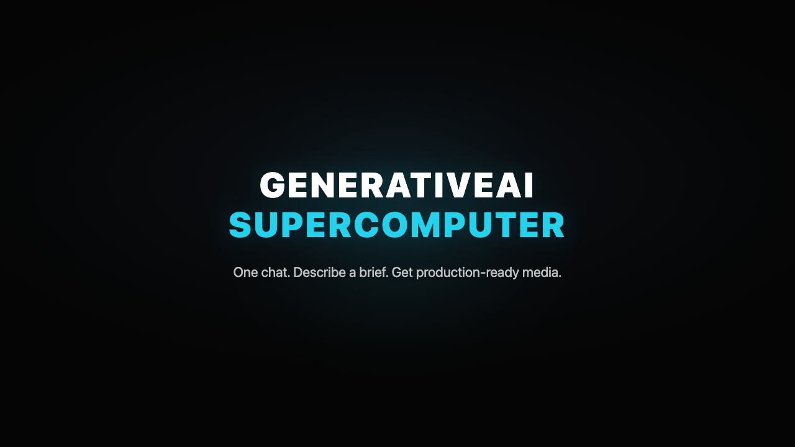

<div align="center">

# 🧠 GenerativeAI Supercomputer

### The open-source, agentic alternative to AI creative platforms

**One chat. Describe a brief. Get production-ready images, video, audio, and full campaigns.**

You don't pick models and write prompts — you describe the outcome, and an agent plans the
workflow, picks the best model for each step, runs them, checks the results, remembers your
brand, and delivers finished assets. Self-hosted, vendor-neutral, MIT-licensed.

[](LICENSE)
[](https://muapi.ai)
[](#-swappable-llm-brain)

</div>

---

## 🎬 60-second demo

<video src="https://github.com/whyujjwal/GenerativeAI-Supercomputer/raw/main/promo/out/promo.mp4" controls poster="promo/out/poster.png" width="100%"></video>

> ▶️ **[Click here to watch the 60-second demo](https://github.com/whyujjwal/GenerativeAI-Supercomputer/raw/main/promo/out/promo.mp4)** (if the player doesn't load inline)

[](https://github.com/whyujjwal/GenerativeAI-Supercomputer/raw/main/promo/out/promo.mp4)

---

## What makes it different

Most generative tools make **you** the orchestrator: pick a model, write the prompt, download,
repeat for every step. This project flips that. You give the agent a goal —
*"a 15-second TikTok ad for my sneakers, then post it to Slack"* — and it:

1. **Plans** the workflow into ordered steps
2. **Selects** the best model for each step from 200+ hosted models
3. **Confirms** the plan with you before spending anything
4. **Executes** the generation tools, chaining outputs into inputs
5. **Reviews** results and retries on failure
6. **Remembers** your brand, style, and past work across sessions
7. **Delivers** to your tools (Slack, Drive, Notion, Gmail) or on a schedule

---

## ✨ Features

### 🤝 Agentic "one chat" workflow
Describe a brief in natural language. The agent decomposes it, picks models, and runs the
whole pipeline — no prompt engineering, no tool-hopping. Every plan is shown with an
**Approve / Cancel** gate before any credits are spent.

### 🧩 Swappable LLM brain
Switch the reasoning engine **mid-conversation** between **Claude**, **OpenAI (GPT)**, and
**Gemini**. One provider-agnostic loop, three adapters — each translated to its native
tool-calling format. Bring your own key per provider.

### 🎨 200+ generative models as tools
The agent orchestrates the full [Muapi.ai](https://muapi.ai) catalog through declarative tools:
text-to-image, image-to-image, text-to-video, image-to-video, lip-sync, and file upload — Flux,
Nano Banana, Seedream, Kling, Sora, Veo, Wan, and many more.

### 🧠 Three-layer memory
- **Working** — live state for the current task
- **Long-term** — your brand voice, style preferences, and guidelines, injected into every run
- **Episodic** — successful brief → plan → model → params, recorded for reuse

### ⚡ Skills
Reusable, installable workflows invoked with a `/trigger`: `/cinematic`, `/montage`,
`/product`, `/ugc`, `/portrait-talk` — plus a marketplace of community skills
(`/unbox`, `/kinetic-type`, `/tryon`, `/thumbnail`, `/data-viz`). Add your own.

### 👔 AI-employee personas
Pre-built specialists that bundle a role persona + curated skills:
**Product Photographer · Motion Designer · Podcast Producer · Cartoon Animator · Ad Director.**
Activate one and the agent adopts its expertise.

### 🛍️ Marketplace
Browse and activate personas, install community skills — all from inside the studio.

### 🔌 Connectors *(self-hosted backend)*
Connect **Slack**, **Google Drive**, **Gmail**, and **Notion** via OAuth. The agent gains
connector tools (post a message, upload a file, send an email, create a page) and can deliver
generated assets straight to your tools.

### ⏰ Scheduling *(self-hosted backend)*
Schedule briefs with cron — *"a fresh product shot every morning at 9am"* — and the
**server-side agent runtime** runs them unattended, 24/7, even with the app closed.

### 💬 Telegram bot *(self-hosted backend)*
Submit briefs from Telegram and get finished images/videos back in chat. Webhook-secured.

---

## 🏗️ Architecture

```
┌───────────────────────────── CLIENT (Electron / Vite, vanilla JS) ─────────────────────────────┐
│                                                                                                 │
│  Supercomputer Studio (chat UI)                                                                 │
│        │                                                                                        │
│        ▼                                                                                        │
│  Agent loop  ──provider-agnostic──▶  LLM brain   { Claude | OpenAI | Gemini }                   │
│        │                                                                                        │
│        ├── plan → confirm → execute → review                                                    │
│        ├── memory (working / brand / episodic)   ── skills ── personas                          │
│        │                                                                                        │
│        ▼                                                                                        │
│  Tool registry                                                                                  │
│     ├── generation tools  ──▶  Muapi.ai  (200+ image / video / audio / lipsync models)          │
│     └── connector tools   ──▶  ┐                                                                 │
└────────────────────────────────┼───────────────────────────────────────────────────────────────┘
                                  │ HTTP
┌───────────────────────────── SERVER (Node / Express, optional, self-hosted) ───────────────────┐
│   OAuth (Slack/Google/Notion) · AES-256-GCM token vault · connector actions                     │
│   Server-side agent runtime (Node-native providers + Muapi + tools)                             │
│   node-cron scheduler · Telegram webhook                                                        │
└─────────────────────────────────────────────────────────────────────────────────────────────────┘
```

The client is **100% standalone** — connectors, scheduling, and Telegram are **opt-in** and only
active when you run the backend. Without the server, the app is a fully working agentic studio.

### Repository layout

```
.
├── src/                     # Standalone Vite/Electron app (vanilla JS)
│   ├── components/
│   │   └── SupercomputerStudio.js   # the agentic chat studio
│   └── lib/agent/           # agent core
│       ├── llmProvider.js   # Claude / OpenAI / Gemini adapters + factory
│       ├── agentLoop.js     # provider-agnostic plan→execute→review loop
│       ├── tools.js         # generation tools over Muapi
│       ├── memory.js        # 3-layer memory
│       ├── skills.js · builtinSkills.js
│       ├── personas.js · marketplace.js
│       ├── connectorTools.js · backendClient.js
├── server/                  # Optional Node/Express backend
│   └── src/
│       ├── oauth/ · connectors/ · crypto.js · tokenStore.js
│       ├── agent/           # Node-native agent runtime (unattended runs)
│       ├── schedules/       # node-cron scheduler + REST CRUD
│       └── telegram/        # webhook bot
├── packages/studio/         # shared model catalog
├── promo/                   # Remotion promo video project
└── docs/superpowers/specs/  # design specs for every phase
```

---

## 🚀 Quick start

> Requires [Node.js](https://nodejs.org/) v18+ and a [Muapi.ai access key](https://muapi.ai/access-keys).

### The app (client only — fully functional)

```bash
npm run setup          # install deps + build the studio package

npm run electron:dev   # desktop app (Electron + Vite)  — recommended
# or
npm run vite:dev       # web app  → http://localhost:5173
```

Open the **Supercomputer** studio, paste your Muapi key and at least one LLM key
(Anthropic / OpenAI / Gemini), pick a brain, and describe a brief.

### The backend (optional — connectors, scheduling, Telegram)

```bash
cp server/.env.example server/.env
# fill in TOKEN_ENC_KEY, provider OAuth creds, and agent keys (MUAPI_KEY, ANTHROPIC_KEY, …)
#   generate a key:  node -e "console.log(require('crypto').randomBytes(32).toString('hex'))"

npm run server:dev     # boots on http://localhost:8787
```

Then in the studio's **Connectors** panel, set the backend URL and connect your providers.
Create cron schedules in the **Schedules** panel. To enable Telegram, set
`TELEGRAM_BOT_TOKEN` + `TELEGRAM_WEBHOOK_SECRET` and run `node server/scripts/set-telegram-webhook.js`.

---

## 🔒 Security

- LLM and Muapi keys live in the client's `localStorage` (browser-direct API calls), never sent
  to any third party except the model provider.
- OAuth **client secrets and user tokens live only on the server**, never in the client bundle.
- Connector tokens are **AES-256-GCM encrypted at rest**.
- CORS is locked to the app origin; OAuth uses CSRF `state` tied to the session; the Telegram
  webhook verifies a secret token. `.env` is gitignored — only `.env.example` is committed.

---

## 🛠️ Tech stack

**Client:** Vite · vanilla JS · Tailwind CSS · Electron
**Server:** Node · Express · node-cron · AES-256-GCM
**Models:** [Muapi.ai](https://muapi.ai) (200+ hosted models) · local inference (sd.cpp / Wan2GP, desktop)
**Brains:** Claude · OpenAI GPT · Google Gemini
**Promo:** Remotion

---

## 🗺️ How it was built

Built in six reviewed phases, each with a design spec in
[`docs/superpowers/specs/`](docs/superpowers/specs/):

| Phase | What shipped |
|------:|--------------|
| 1 | Agent core (provider abstraction, tool registry, loop) + chat studio |
| 2 | OpenAI + Gemini providers, mid-chat brain swap, plan-confirm gate |
| 3 | 3-layer memory + skills system |
| 4 | AI-employee personas + skill marketplace |
| 5 | Node/Express backend: OAuth + connectors (Slack/Drive/Gmail/Notion) |
| 6 | Server-side agent runtime: cron scheduling + Telegram bot |

---

## 📄 License

MIT — see [LICENSE](LICENSE). Foundation studio derived from
[Open Generative AI](https://github.com/Anil-matcha/Open-Generative-AI) (MIT).
